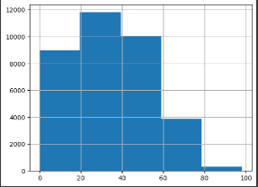

# *Music Recommendation syste*m, Rekomendasi Musik Spotify dengan _Content-based Filtering_.

## Latar Belakang

Musik telah menjadi bagian tak terpisahkan dari kehidupan manusia, sejak manusia mulai mengenalnya. Dari bangun tidur hingga tidur lagi, banyak orang sering kali mendengarkan musik untuk meningkatkan _mood_, meningkatkan konsentrasi saat belajar, dan menjadikan musik sebagai teman untuk beraktivitas. Dengan perkembangan teknologi, platform streaming musik seperti Spotify telah memungkinkan kita untuk memiliki akses tak terbatas ke berbagai genre dan artis. Spotify menawarkan musik dan siniar yang dilindungi hak ciptanya secara digital, termasuk lebih dari 70 juta lagu dari label rekaman dan perusahaan media. Spotify beroperasi dengan freemium, sebuah fitur gratis beserta iklan dan kontrol terbatas, sementara fitur tambahan, seperti mendengarkan secara luring dan mendengarkan bebas komersial, ditawarkan melalui langganan berbayar. Pengguna dapat mencari musik berdasarkan artis, album, atau genre, dan dapat membuat, mengedit, dan berbagi daftar putar[1]. Namun, dengan begitu banyak pilihan yang tersedia, mencari musik baru yang sesuai dengan preferensi kita bisa menjadi tugas yang menantang. oleh karena itu pada proyek ini penulis membuat sebuah sistem rekomendasi berbasis konten(_content-based filtering_) untuk merekomendasikan musik sesuai dengan preferensi.

## Business Understanding

### Problem Statements

Berdasarkan Latar belakang masalah tersebut, penulis mengembangkan sistem rekomendasi musik berbasis konten(_content based filtering_) untuk menjawab pertanyaan sebagai berikut:

1. Bagaimana cara membuat sebuah sistem rekomendasi musik sesuai dengan selera pengguna dengan menggunakan content based filtering.
2. Apakah content based filtering merupakan sistem rekomendasi yang efektif untuk merekomendasikan musik?

### Goals

Adapun tujuan dibuatnya sistem rekomendasi musik adalah sebagai berikut:

1. Membuat sebuah sistem rekomendasi musik yang sesuai dengan musik yang sebelumnya pengguna dengar.
2. Memberikan rekomendasi musik yang sesuai dengan selera musik pengguna.

### Solution Statements

Pada dasarnya, proses content-based filtering di Spotify melibatkan beberapa langkah penting:

- Ekstraksi Fitur<br>
  Penulis menganalisis setiap fitur dalam dataset. Fitur ini dapat mencakup tempo (kecepatan), durasi, energi, genre dan lain-lain. Setiap fitur ini memberikan pandangan yang lebih mendalam tentang komposisi dan gaya musik suatu lagu.

- Feature Engineering <br>
  Selanjutnya penulis membuat fitur - fitur baru seperti fitur hasil TF-IDF dari fitur genre, melakukan scaling fitur terhadap fitur numerik dengan min-max scaler dll.(selengkapnya bisa dilihat pada tahap data preparation)

- Kesamaan Fitur <br>
  Dengan menggunakan algoritma _cosine-similiarity_, penulis membandingkan fitur-fitur dari setiap lagu yang ada. Semakin mirip karakteristik musik kedua lagu, semakin besar kemungkinan pengguna akan menyukai lagu baru yang memiliki kesamaan ini.

- Rekomendasi <br>
  Setelah kesamaan fitur ditemukan, lagu-lagu yang memiliki karakteristik serupa dengan lagu-lagu yang sudah disukai oleh pengguna akan direkomendasikan. Hal ini memungkinkan pengguna menemukan musik baru yang tetap konsisten dengan preferensi mereka.

- Evaluasi<br>
Untuk mengukur keandalan sistem rekomendasi digunakan metrik evaluasi precision. Dalam sistem rekomendasi precision adalah jumlah item yang dipilih yang relevan

## Data Understanding

Berikut adalah informasi umum mengenai dataset yang digunakan:

<table border>
  <tr>
    <td>Sumber Dataset</td>
    <td>Kaggle: <a href ="https://www.kaggle.com/datasets/maharshipandya/-spotify-tracks-dataset/code">Link</a></td>
  </tr>
  <tr>
    <td>Nama Dataset</td>
    <td>Spotify Tracks Dataset</td>
  </tr>
  <tr>
      <td>Deskripsi singkat</td>
      <td>Kumpulan data lagu-lagu Spotify dengan berbagai genre dan fitur audionya</td>
  </tr>
  <tr>
      <td>Masalah Terkait</td>
      <td>Klasifikasi dan Rekomendasi</td>
  </tr>

  <tr>
      <td>Jumlah Atribut/fitur</td>
      <td>21</td>
  </tr> 
  <tr>
      <td>Jumlah Instance</td>
      <td>114000</td>
  </tr> 
</table>

### Deskripsi Variabel

Berkas yang diunduh memiliki format .zip setelah berkas tersebut diekstrak terdapat sebuah dataset yaitu dataset.csv dataset tersebut memiliki 114000 baris dan 21 kolom. berikut adalah informasi mengenai atribut/fitur pada dataset.

<table border>
    <tr>
        <th>Nama Fitur</th>
        <th>Penjelasan</th>
    </tr>
    <tr>
        <td>track_id</td>
        <td>Spotify ID untuk lagu</td>
    </tr>
    <tr>
        <td>artists</td>
        <td>Nama-nama artis yang menampilkan lagu. Jika lebih dari satu artis, dipisahkan oleh tanda titik koma (;)</td>
    </tr>
    <tr>
        <td>album_name</td>
        <td>Nama album tempat lagu ditampilkan</td>
    </tr>
    <tr>
        <td>track_name</td>
        <td>Nama dari lagu</td>
    </tr>
    <tr>
        <td>popularity</td>
        <td>Popularitas lagu adalah nilai antara 0 dan 100, dengan 100 sebagai yang paling populer.</td>
    </tr>
    <tr>
        <td>duration_ms</td>
        <td>Durasi lagu dalam milidetik</td>
    </tr>
    <tr>
        <td>explicit</td>
        <td>Apakah lagu mengandung lirik eksplisit (true = ya ada; false = tidak ada atau tidak diketahui)</td>
    </tr>
    <tr>
        <td>danceability</td>
        <td>Danceability menggambarkan seberapa cocok lagu untuk menari berdasarkan kombinasi elemen musikal</td>
    </tr>
    <tr>
        <td>energy</td>
        <td>Energi adalah ukuran dari 0.0 hingga 1.0 dan mewakili ukuran persepsi intensitas dan aktivitas dari lagu</td>
    </tr>
    <tr>
        <td>key</td>
        <td>Kunci dari lagu. Bilangan bulat menggambarkan nada menggunakan notasi Pitch Class standar. Misalnya 0 = C, 1
            = C♯/D♭, 2 = D, dan seterusnya. Jika tidak ada kunci yang terdeteksi, nilainya adalah -1
        </td>
    </tr>
    <tr>
        <td>loudness</td>
        <td>Kekerasan keseluruhan dari lagu dalam desibel (dB)</td>
    </tr>
    <tr>
        <td>mode</td>
        <td>
            Mode menunjukkan modalitas (mayor atau minor) dari sebuah lagu, jenis tangga nada yang menjadi sumber konten
            melodinya. Mayor diwakili oleh 1 dan minor adalah 0
        </td>
    </tr>
    <tr>
        <td>speechiness</td>
        <td>Speechiness mendeteksi keberadaan kata-kata yang diucapkan dalam trek. Semakin eksklusif rekaman tersebut
            seperti ucapan (misalnya, acara bincang-bincang, buku audio, puisi), semakin mendekati 1,0 nilai atributnya.
            Nilai di atas 0,66 menggambarkan trek yang mungkin seluruhnya terdiri dari kata-kata yang diucapkan. Nilai
            antara 0,33 dan 0,66 menggambarkan trek yang mungkin berisi musik dan ucapan, baik dalam beberapa bagian
            atau berlapis, termasuk kasus seperti musik rap. Nilai di bawah 0,33 kemungkinan besar mewakili musik dan
            trek yang tidak mirip ucapan lainnya</td>
    </tr>
    <tr>
        <td>acousticness</td>
        <td>Ukuran keyakinan dari 0,0 hingga 1,0 tentang apakah trek tersebut akustik. 1,0 menunjukkan keyakinan tinggi
            bahwa trek tersebut adalah akustik</td>
    </tr>
    <tr>
        <td>instrumentalness</td>
        <td>Memprediksi apakah lagu tidak mengandung vokal</td>
    </tr>
    <tr>
        <td>liveness</td>
        <td>Mendeteksi keberadaan penonton dalam rekaman</td>
    </tr>
    <tr>
        <td>valence</td>
        <td>Ukuran dari 0.0 hingga 1.0 yang menggambarkan kepositifan musikal yang disampaikan oleh lagu.</td>
    </tr>
    <tr>
        <td>tempo</td>
        <td>Tempo keseluruhan perkiraan dari lagu dalam ketukan per menit (BPM).</td>
    </tr>
    <tr>
        <td>time_signature</td>
        <td>Perkiraan tanda birama. Tanda birama (meter) adalah konvensi notasi untuk menentukan berapa banyak ketukan
            dalam setiap bar (atau ukuran). Tanda birama berkisar antara 3 hingga 7 yang mengindikasikan tanda birama
            3/4, hingga 7/4.</td>
    </tr>
    <tr>
        <td>track_genre</td>
        <td>Genre di mana lagu tersebut termasuk</td>
    </tr>
</table>

### Menangani Nilai duplikat dan Missing Value, Melakukan sampling Pada dataset.

#### Menangani Nilai Duplikat

Setelah dilakukan pengecekan nilai duplikat pada dataset ditemukan 450 nilai duplikat pada dataset, penulis langsung menghapus nilai duplikat tersebut.

Namun Terdapat hal menarik pada dataset, Duplikasi data terjadi bukan hanya karena terdapat n buah data yang memiliki informasi yang sama tetapi, Duplikasi pada data terjadi juga karena banyak lagu yang memiliki lebih dari 1 genre.

| track_id | artists                | album_name | track_name | track_genre |
| -------- | ---------------------- | ---------- | ---------- | ----------- |
| 65003    | 1R0hxCA5R7z5TiaXBZR7Mf | JENNIE     | SOLO       | k-pop       |
| 81916    | 1R0hxCA5R7z5TiaXBZR7Mf | JENNIE     | SOLO       | pop         |

untuk menangani masalah tersebut penulis menyatukan semua lagu yang sama tapi memiliki genre yang berbeda menjadi satu record data dengan menggunakan sedikit kode Python.

| track_id | artists                | album_name | track_name | track_genre |
| -------- | ---------------------- | ---------- | ---------- | ----------- |
| 65003    | 1R0hxCA5R7z5TiaXBZR7Mf | JENNIE     | SOLO       | k-pop, pop  |

setelah digabungkan nilai duplikat pada dataset akan menjadi sangat banyak. selanjutnya penulis menghapus semua nilai duplikat tersebut.

#### Menangani _Missing Value_

Terdapat _missing value_ pada satu record dalam dataset _missing value_ tersebut terdapat pada fitur artists, album_name, track_name. dikarenakan hanya terdapat satu _missing value_ pada dataset, penulis menghapus record yang memiliki _missing value_ tersebut.

#### *Sampling*

Dikarenakan penulis mengalami masalah keterbatasan resource untuk mengolah semua dataset, penulis hanya mengambil 35000 data sampel dari 114000 data lagu tersebut. pengambilan sample dilakukan menggunakan method sample() dari *library* Pandas. Ketika menggunakan *method* sample() di Pandas, distribusi sampel secara umum akan menyerupai distribusi populasi [2], jadi tidak perlu khawatir akan terjadi bias pada sampel.

### Univariate Analysis

Untuk mengetahui persebaran data pada setiap fitur dalam dataset penulis melakukan analisis untuk setiap fitur dalam dataset.

#### Fitur Kategorikal

Adapun pengertian sederhana dari fitur kategorikal adalah fitur yang memiliki tipe data objek atau string.

##### Fitur track_name

Track name atau judul lagu merupakan data bertipe objek akan sangat baik jika fitur ini divisualisasikan menggunakan wordcloud.


Ternyata banyak sekali lagu yang memiliki judul lagu yang mengandung kata "Love", "Remastered","Remix", "Feat" atau featuring  dan istilah dalam bahasa portugis seperti "Vivo" yang berarti hidup dan "Ao" yang berarti untuk atau dalam bahasa inggris memiliki arti "to the".

##### Fitur album_name

Album name atau nama album dari lagu juga bertipe data objek. sehingga penulis menggunakan wordcloud unruk memvisualisasikan datanya.


Banyak album yang mengandung kata "Motion", "Picture", "Original", dan istilah bahasa portugis "Ao" dan "Vivo" yang digunakan juga untuk menamai sebuah album.

##### Fitur artist

Siapakah artis atau _musician_ yang mendominasi sampel data?. pertanyaan ini akan dijawab oleh wordcloud berikut.


Banyak artis yang memiliki nama DJ, Bad, Bunny. selain itu terdapat juga artis yang penulis kenal yaitu seorang pianis klasik terkenal abad 18 Wolfgang Amadeus Mozart dan band terkenal seperti The beatles dan Linkin park.

##### Fitur track_genre
Dikarenakan fitur track genre memiliki nilai unik yang sangat banyak penulis hanya memvisualisasikan 25 genre yang paling banyak terdapat pada dataset berikut adalah visualisasi untuk fitur track_genre


bisa disimpulkan jika semua genre pada dataset memiliki jumlah lagu yang hampir seimbang. 

#### Fitur Numerik

Kebalikan dari fitur kategorikal, fitur numerik adalah fitur yang memiliki tipe data integer atau float.

##### Fitur duration

Duration atau durasi dari lagu disimpan dalam format *milisecond*, agar mudah untuk dipahami penulis mengonversinya menjadi satuan menit berikut adalah informasi statistik dari durasi lagu untuk semua dataset:

|     | Statistik       | Nilai |
| --: | :-------------- | ----: |
|   0 | Rata-rata       |  3.83 |
|   1 | Standar Deviasi |  2.02 |
|   2 | Minimum         |  0.29 |
|   3 | Kuartil 1       |  2.89 |
|   4 | Median          |  3.56 |
|   5 | Kuartil 3       |  4.42 |
|   6 | Maksimum        | 79.82 |

rata-rata dari lagu memiliki durasi 3.8 menit namun terdapat lagu yang memiliki durasi sampai mendekati 80 menit.

##### Fitur danceability, energy dan loudness

Seperti yang sudah dijelaskan sebelumnya danceability adalah ukuran untuk seberapa cocok sebuah lagu untuk menari berikut adalah histogram dari fitur danceabilty


Dapat disimpulkan jika rata-rata lagu memiliki sifat danceability sekitar 0.6 yang artinya rata-rata lagu sedikit cocok untuk menari karena lagu yang dianggap cocok untuk menari adalah lagu yang memiliki danceability mendekati 1.

Energi adalah ukuran persepsi intensitas dan aktivitas dari lagu. berikut adalah histogram dari fitur energy pada lagu

dapat dilihat semakin banyak jumlah sampel lagu, tingkat energi semakin meningkat. ini bisa menunjukkan bahwa genre musik yang lebih energik seperti rock, metal, atau EDM mungkin lebih banyak mewakili dataset tersebut dibandingkan dengan genre musik yang lebih tenang atau lambat seperti klasik

Loudness adalah Kekerasan keseluruhan dari lagu dalam desibel (dB) berikut adalah histogram dari fitur loudness.

berdasarkan histogram tersebut dapat disimpulkan bahwa kebanyakan lagu memiliki suara yang keras.

##### Fitur speechness, accousticness, dan instrumentalness

Berikut adalah histogram dari fitur speechness, accousticness, dan instrumentalness:


Dari histogram tersebut, dapat disimpulkan bahwa mayoritas trek memiliki tingkat "speechness" yang rendah. Hal ini mengindikasikan bahwa sebagian besar trek merupakan musik. Selain itu, banyak sampel dalam dataset memiliki tingkat "acousticness" yang rendah. Oleh karena itu, dapat disimpulkan bahwa sebagian besar lagu bukanlah akustik. Terakhir, frekuensi lagu-lagu yang memiliki tingkat "instrumentalness" rendah cukup tinggi. Dari hal ini, dapat disimpulkan bahwa mayoritas lagu bukanlah lagu instrumental dalam konteks isi dari lagu.

##### Fitur liveness dan valence

Berikut adalah histogram dari fitur "liveness" dan "valence".


Dari histogram tersebut dapat disimpulkan bahwa mayoritas musik tidak memiliki penonton (live) saat rekaman hal ini didasarkan pada tingginya frekuensi lagu yang memiliki liveness yang rendah.

Selain itu "valence" dari lagu juga sangat bervariasi.fitur valence sendiri menggambarkan kepositifan yang disampaikan oleh lagu. bisa disimpulkan jika tidak semua lagu menyampaikan hal yang positif.

##### Fitur key_notes , mode, dan time_signature

Berikut adalah histogram dari fitur key_note, mode, dan time_signature:


Dari histogram tersebut bisa disimpulkan jika banyak sekali lagu yang memiliki kunci dasar antara C sampai D. lagu dengan kunci dasar C atau D umumnya adalah lagu yang mudah dimainkan dengan instrumen gitar atau instrumen lain selain itu mayoritas lagu menggunakan tanda nada mayor, dan memiliki birama ketukan 4/4.

##### Fitur popularity dan tempo
Berikut adalah histogram dari fitur tempo



Dapat diketahui bahwa fitur popularity memiliki nilai yang sangat berbeda dengan fitur lainnya fitur ini memiliki nilai dari 1 - 100, sedangkan fitur lain nilainya hanya sekitar 0-1 atau 1-10 oleh karena itu penulis membagi nilai dalam fitur popularity menjadi 5 kategori.


Begitu pula dengan fitur tempo yang nilainya antara 0 - 221 penulis membagi nilai dalam fitur tempo menjadi 5 bagian.


## Data preparation

Pada tahap ini penulis melakukan feature engineering atau pembuatan fitur diantaranya merubah fitur genre menjadi matrix TF-IDF dan membuat one-hot-encoding dari fitur popularity dan tempo. selain melakukan feature engineering penulis juga melakukan feature-scaling pada data numerik menggunakan Min Max Scaler.

### TF-IDF Fitur genre
Term frequency–inverse document frequency, adalah ukuran statistik yang menggambarkan pentingnya suatu istilah terhadap sebuah dokumen dalam sebuah kumpulan atau korpus. Ukuran ini sering dipakai sebagai faktor pembobot dalam pencarian temu balik informasi, text mining, dan user modeling[3]. 

TF-idf digunakan untuk merubah fitur genre yang memiliki nilai string menjadi matriks numerik yang merepresentasikan genre dari lagu. jika sebuah lagu memiliki 2 atau lebih genre maka penggunaan TF-IDF **tidak** menentukan arah dominan dari genre-genre tersebut melainkan hanya merubahnya menjadi nilai numerik. berikut adalah salah satu contoh lagu yang sudah dikonversi menjadi matriks tf-idf

| track_name | genre-pop | genre-dance | genre-electro| genre-indie-pop |
|------------|-----------|-------------|--------------|-----------------|
| Without Me | 0.443621  | 0.446681    | 0.454993     | 0.445443        |


### One-Hot Encoding fitur popularity dan fitur tempo
One-hot encoding adalah teknik yang digunakan dalam machine learning dan analisis data untuk mengubah variabel kategorikal menjadi representasi matriks biner. Teknik ini terutama digunakan untuk merepresentasikan data kategorikal dalam format yang dapat dengan mudah diproses oleh algoritme, karena banyak model pembelajaran mesin yang memerlukan input numerik. Setiap kategori diwakili oleh vektor biner unik di mana semua elemen bernilai 0 kecuali untuk indeks yang sesuai dengan kategori, yang setel ke 1[4]. pada tahap understanding penulis membagi nilai data dari fitur popularity dan fitur tempo menjadi 5 kategori yang berbeda. agar nilai kategori tersebut dapat diproses oleh algoritma cosine-similarity maka menulis merubahnya kedalam matriks numerik dengan teknik one hot encoding.


### Normalisasi fitur numerik dengan min-max scaler
Min-max scaler merupakan salah satu teknik dalam preprocessing data pada machine learning. Teknik ini digunakan untuk mengubah skala nilai dari fitur-fitur dalam dataset agar nilainya berada dalam rentang tertentu, biasanya antara 0 dan 1[5]. normalisasi pada data dilakukan agar algotitma cosine-similiarity tidak terlalu sensitif pada data yang bernilai besar.

## Modeling

Seperti yang dijelaskan pada tahap Business Understanding kita akan mengembangkan model machine learning dengan tiga algoritma yang berbeda. Kemudian, kita akan membandingkan mean absolute error dan waktu training masing-masing algoritma dan menentukan algoritma mana yang memberikan hasil prediksi terbaik. Ketiga algoritma tersebut antara lain:

### Cosine Similarity
Cosine similarity adalah metrik yang digunakan untuk mengukur kemiripan antara dua vektor yang tidak nol dalam ruang multi-dimensi. Metrik ini mengukur kosinus sudut antara dua vektor, yang berkisar dari -1 (arah yang sepenuhnya berlawanan) hingga 1 (arah yang sepenuhnya sama). Semakin dekat nilai cosine similarity ke 1, semakin mirip vektor tersebut dalam hal orientasi dan arahnya.


penulis membandingkan fitur-fitur yang sudah dipersiapkan pada tahap data preparation. Semakin tinggi nilai cosine similarity di antara lagu-lagu tersebut, semakin mirip karakteristik musiknya, yang meningkatkan kemungkinan pengguna akan menikmati lagu baru yang memiliki kemiripan ini.

### Melakukan Rekomendasi
Setelah kesamaan fitur ditemukan, lagu-lagu yang memiliki karakteristik serupa dengan lagu-lagu yang sudah disukai oleh pengguna akan direkomendasikan. Hal ini memungkinkan pengguna menemukan musik baru yang tetap konsisten dengan preferensi mereka. berikut adalah hasil rekomendasi lagu:

lagu yang pengguna dengar: DDU-DU DDU-DU - BLACKPINK

| track_name                            | artists                                               | album_name                                | similiarity_score |
|---------------------------------------|-------------------------------------------------------|-------------------------------------------|-------------------|
| Love Shot                             | EXO                                                   | LOVE SHOT– The 5th Album Repackage        | 0.993455          |
| Black Swan                            | BTS                                                   | Black Swan                               | 0.992694          |
| VILLAIN                               | K/DA;Madison Beer;Kim Petras;League of Legends       | ALL OUT                                   | 0.991990          |
| HOME                                  | BTS                                                   | MAP OF THE SOUL : PERSONA                | 0.991158          |
| LA DI DA                              | EVERGLOW                                              | -77.82x-78.29                            | 0.988543          |
| I NEED U                              | BTS                                                   | Proof                                   | 0.986266          |
| Likey                                 | TWICE                                                 | Twicetagram                               | 0.985638          |
| Lonely Boy (The tattoo on my ring finger) | TOMORROW X TOGETHER                               | minisode 2: Thursday's Child            | 0.985497          |
| Anymore                               | JEON SOMI                                             | XOXO                                    | 0.985066          |
| The Eve                               | EXO                                                   | THE WAR - The 4th Album                   | 0.984930          |


Bisa dilihat jika semua lagu yang direkomendasikan adalah lagu k-pop yang menandakan rekomendasi yang diberikan sesuai dengan preferensi musik pengguna, namun direkomendasi tersebut tidak terdapat lagu dari grup musik Blackpink yang mungkin adalah artis favorit pengguna. Hal ini dikarenakan penulis tidak memasukan fitur artist pada saat menghitung cosine-similarity dari fitur lagu.

## Evaluasi

### Precision Rekomendasi

Precision adalah ukuran seberapa banyak prediksi positif yang dibuat adalah benar (true positive). Dalam sistem rekomendasi precision adalah jumlah item yang dipilih yang relevan. Jadi, misalkan sistem rekomendasi memilih 3 item untuk direkomendasikan kepada pengguna dan 2 di antaranya relevan, maka precision akan menjadi 66%[6].


untuk mengukur relevan tidaknya rekomendasi penulis menetapkan sebuah aturan yaitu jika rekomendasi yang diberikan memiliki cosine-similiarity lebih dari 0.95 maka rekomendasi tersebut relevan. Sehingga precision dari hasil rekomendasi lagu  DDU-DU DDU-DU - BLACKPINK adalah 100%
```
Precision = (Jumlah item yang relevan / Jumlah item yang direkomendasikan) * 100%

Precision = (10 / 10) * 100%
Precision = 100%

```


## Kesimpulan

Sistem rekomendasi berbasis konten yang telah dibuat terbilang cukup efektif karena model tersebut dapat merekomendasikan lagu sesuai dengan gaya musik lagu yang sudah didengar oleh pengguna. Hal ini memungkinkan pengguna menemukan musik baru yang tetap konsisten dengan preferensi mereka. tetapi terdepat hal yang harus diperbaiki yaitu sistem rekomendasi tersebut tidak merekomendasikan lagu yang memiliki artis yang sama dengan lagu yang pengguna dengar Hal ini dikarenakan penulis tidak memasukan fitur artist pada saat menghitung cosine-similarity dari fitur lagu.


## Referensi

[1] https://id.wikipedia.org/wiki/Spotify<br>
[2] https://pandas.pydata.org/docs/reference/api/pandas.DataFrame.sample.html <br>
[3] https://en.wikipedia.org/wiki/Tf%E2%80%93idf<br>
[4] https://machinelearningmastery.com/why-one-hot-encode-data-in-machine-learning/<br>
[5] https://en.wikipedia.org/wiki/Feature_scaling <br>
[6] https://towardsdatascience.com/an-exhaustive-list-of-methods-to-evaluate-recommender-systems-a70c05e121de
